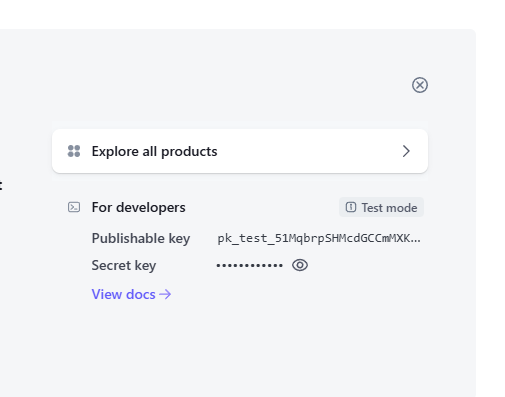

## PayON

PayON is an online platform designed for creators to sell digital products directly to their customers. It offers a seamless experience for selling items like eBooks, courses, music, software, and other downloadable content. PayON manages payment processing and file delivery. With its user-friendly interface, PayON makes it easy for individuals and small businesses to monetize their digital creations without requiring extensive technical skills.

### Table of Contents

-   [Features](#features)
-   [Technologies](#technologies)
-   [Getting Started](#getting-started)
-   [Stripe Implementation Guide](#stripe-implementation-guide)
-   [Contributing](#contributing)
-   [License](#license)

### Getting Started

To get a local copy of this project up and running, follow these steps:

1. **Clone the repository:**

    ```bash
    git clone https://github.com/akashdebnath-swe/PayON
    cd PayON
    ```

2. **Install dependencies:**

    ```bash
    npm install
    ```

3. **Set up Enviroment Variables:**

    - change the `.env.example` to `.env`
    - For stripe env keys check out the [stripe setup guide](#stripe-implementation-guide)

4. **Run the application:**

    ```bash
    npm run dev
    ```

5. **Open your browser and navigate to:**
    ```
    http://localhost:3000
    ```

### Stripe Implementation Guide

-   **First add this libraries**

```bash
npm install --save stripe @stripe/stripe-js
```

-   **Creating Payment Intent**

PaymentIntent is what tracks the customer's payment lifecycle, keeping track of any failed payment attempts and ensuring the customer is only charged once.

Endpoint: `/products/[id]/purchase`
<br>

`server side`

```tsx
import Stripe from "stripe";

const stripe = new Stripe(process.env.STRIPE_SECRET_KEY as string);

const product = // coming from database.

const paymentIntent = await stripe.paymentIntents.create({
    amount: product.priceInCents,
    currency: "USD",
    metadata: { productId: product.id },
});

if (paymentIntent.client_secret == null) {
    throw Error("Stripe failed to create payment intent");
}
```

> The `client_secret` is a unique identifier generated by Stripe for a specific Payment Intent. It is used to securely manage the payment process, ensuring that the client-side application can confirm the status of the payment. The `client_secret` helps track whether the payment has succeeded, failed, or is still pending, and is essential for securely handling payment interactions between your server and the Stripe API.

<br>

on your stripe dashboard you will get `stripe key & secret`

<br>



## Contributing

Contributions are welcome! If you have suggestions for improvements or want to report bugs, feel free to open an issue or submit a pull request.

## License

This project is licensed under the MIT License. See the [LICENSE](LICENSE) file for details.
